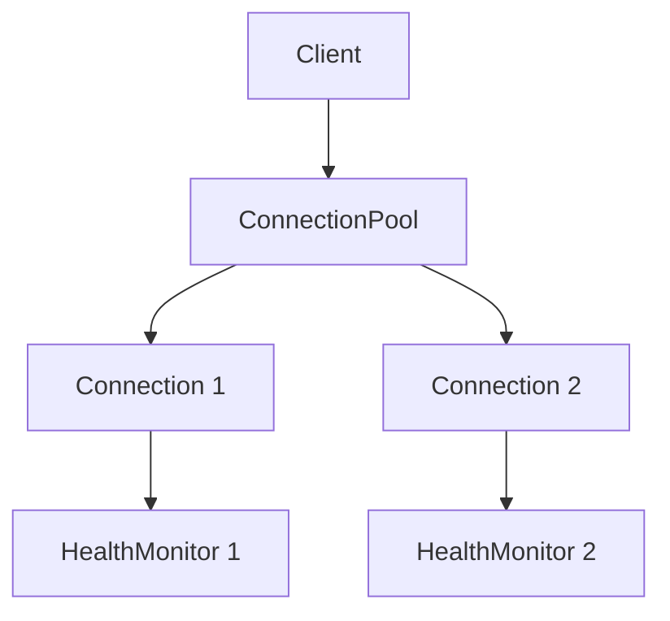

# TODO - Future Optimizations

This document tracks potential optimizations and enhancements for the Dhan Go SDK.

---

## Performance Optimizations

### 1. Unsafe Zero-Copy Parsing (High Risk, High Reward)

**Current:** Using `encoding/binary.LittleEndian` (safe, zero allocation)
```go
func bytesToFloat32(b []byte) float32 {
    bits := binary.LittleEndian.Uint32(b)
    return math.Float32frombits(bits)
}
```

**Potential:** Direct unsafe pointer cast (true zero-copy, ~30-50% faster)
```go
import "unsafe"

func bytesToFloat32Unsafe(b []byte) float32 {
    return *(*float32)(unsafe.Pointer(&b[0]))
}
```

**Considerations:**
- ⚠️ Requires proper alignment (float32 = 4-byte aligned)
- ⚠️ Not portable across architectures (assumes little-endian)
- ⚠️ Go vet will complain
- ⚠️ Must ensure slice has at least 4 bytes
- ✅ ~30-50% faster in tight loops
- ✅ Truly zero allocation

**Recommendation:**
- Benchmark first to see if current implementation is bottleneck
- Only implement if latency < 500µs is critical
- Add build tags for unsafe version: `// +build !safe`

**File:** `websocket/types/marketfeed.go`

---

### 2. Buffer Pool Integration in Middleware

**Current:** Buffer pool exists but not used in hot path

**Potential:** Use buffer pool in middleware for temporary operations
```go
func WSMiddleware(next WSMessageHandler) WSMessageHandler {
    return func(ctx context.Context, msg []byte) error {
        // If we need to copy/transform message
        buf := utils.GetBuffer(len(msg))
        defer utils.PutBuffer(buf)

        copy(buf, msg)
        // Process buf...

        return next(ctx, msg)
    }
}
```

**Considerations:**
- Only beneficial if middleware does message copying/transformation
- Current middleware chain processes in-place (no copy needed)

**Recommendation:**
- Add buffer pool usage if custom middleware requires message copying

**File:** `utils/ws_middleware.go`

---

### 3. Context Propagation Throughout

**Current:** Context created but not used in many operations

**Potential:** Add context.Context to all public APIs
```go
// Current
func (c *Client) Connect(url string) error

// Proposed
func (c *Client) Connect(ctx context.Context, url string) error {
    select {
    case <-ctx.Done():
        return ctx.Err()
    default:
        // proceed with connection
    }
}
```

**Benefits:**
- Proper cancellation support
- Timeout control from caller
- Request tracing/logging via context values
- Idiomatic Go

**Recommendation:**
- Add in v2.0.0 to avoid breaking changes
- Document context usage patterns

**Files:**
- `websocket/orderupdate/client.go`
- `websocket/marketfeed/client.go`

---

### 4. Batch Parsing Optimization

**Current:** Parse one message at a time

**Potential:** Parse multiple messages in single goroutine
```go
func ParseBatch(messages [][]byte) ([]*TickerData, []*QuoteData, error) {
    // Pre-allocate result slices
    tickers := make([]*TickerData, 0, len(messages))
    quotes := make([]*QuoteData, 0, len(messages))

    for _, msg := range messages {
        // Parse and append to appropriate slice
    }

    return tickers, quotes, nil
}
```

**Considerations:**
- Only beneficial if receiving bursts of messages (> 10/batch)
- Requires buffering which adds latency
- Complex to implement with current callback model

**Recommendation:**
- Skip unless profiling shows parsing is bottleneck
- Consider if building batch processing system

---

### 5. SIMD Optimization for Parsing (Advanced)

**Potential:** Use SIMD instructions for parsing multiple fields
```go
import "golang.org/x/sys/cpu"

func ParseQuoteSIMD(data []byte) (*QuoteData, error) {
    if cpu.X86.HasAVX2 {
        // Use AVX2 instructions to parse 8 float32 values at once
        // Requires assembly or compiler intrinsics
    }
    // Fallback to regular parsing
    return ParseQuoteData(data)
}
```

**Considerations:**
- 🔥 Very complex to implement
- 🔥 Requires assembly code
- Platform-specific (x86_64, ARM)
- Minimal benefit for < 1000 msg/sec

**Recommendation:**
- **Skip** unless building HFT system processing > 10k msg/sec
- Profile first - unlikely to be bottleneck

---

## Feature Enhancements

### 6. Connection Pool in Clients

**Current:** ConnectionPoolActor exists but clients don't use it yet

**Status:** Implementation pending

**Task:**
- Refactor `orderupdate/client.go` to use ConnectionPoolActor
- Refactor `marketfeed/client.go` to use ConnectionPoolActor
- Remove direct ConnectionActor spawning from clients

**File:** `websocket/orderupdate/client.go`, `websocket/marketfeed/client.go`

---

### 7. Metrics Aggregation

**Current:** Each connection has separate metrics

**Potential:** Aggregate metrics across all connections
```go
func (pool *ConnectionPoolActor) GetAggregateMetrics() map[string]interface{} {
    // Sum metrics from all connections
    // Return combined stats
}
```

**Recommendation:**
- Implement when ConnectionPool is integrated into clients

---

### 8. Circuit Breaker for Reconnection

**Current:** Fixed retry limit (5 attempts)

**Potential:** Smart circuit breaker
```go
type CircuitBreaker struct {
    failureThreshold   int
    successThreshold   int
    timeout           time.Duration
    state             State // Closed, Open, HalfOpen
}

func (cb *CircuitBreaker) Call(fn func() error) error {
    if cb.state == Open {
        return ErrCircuitOpen
    }
    // Execute with circuit breaker logic
}
```

**Recommendation:**
- Add if users report issues with connection storms

---

### 9. Graceful Degradation

**Potential:** Fallback to REST API if WebSocket fails
```go
type Client struct {
    wsClient   *websocket.Client
    restClient *rest.Client
    fallback   bool
}

func (c *Client) GetQuote(securityID string) (*Quote, error) {
    if c.wsClient.IsConnected() && !c.fallback {
        // Use WebSocket
    } else {
        // Fallback to REST API
    }
}
```

**Recommendation:**
- Implement in application layer, not library
- Library provides primitives, app handles fallback logic

---

## Testing

### 10. Benchmark Suite

**Current:** No benchmarks

**Potential:** Add comprehensive benchmarks
```bash
$ go test -bench=. ./websocket/types/
BenchmarkParseTickerData-8       5000000    250 ns/op    0 B/op   0 allocs/op
BenchmarkParseQuoteData-8        2000000    750 ns/op    0 B/op   0 allocs/op
BenchmarkParseFullData-8         1000000   1800 ns/op    0 B/op   0 allocs/op
```

**Files:**
- `websocket/types/marketfeed_test.go`
- `utils/buffer_pool_test.go`
- `utils/rate_limiter_test.go`

---

### 11. Fuzz Testing

**Potential:** Fuzz binary parsers
```go
func FuzzParseTickerData(f *testing.F) {
    f.Fuzz(func(t *testing.T, data []byte) {
        ParseTickerData(data) // Should never panic
    })
}
```

**Recommendation:**
- Add for security-critical production use

---

## Documentation

### 12. Architecture Diagrams

**Potential:** Add Mermaid diagrams to docs
```markdown

```

---

## Priority

**High Priority:**
1. Connection Pool integration in clients (Feature #6)
2. Context propagation (Optimization #3) - v2.0.0
3. Benchmark suite (Testing #10)

**Medium Priority:**
4. Circuit breaker (Enhancement #8)
5. Metrics aggregation (Enhancement #7)
6. Architecture diagrams (Docs #12)

**Low Priority:**
7. Unsafe zero-copy (Optimization #1) - only if benchmarks show need
8. Buffer pool in middleware (Optimization #2) - edge case
9. Batch parsing (Optimization #4) - specific use case
10. SIMD (Optimization #5) - probably never needed

---

**Last Updated:** 2025-10-19
**Version:** 1.0
